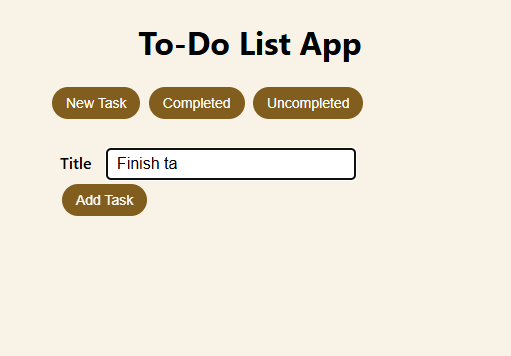
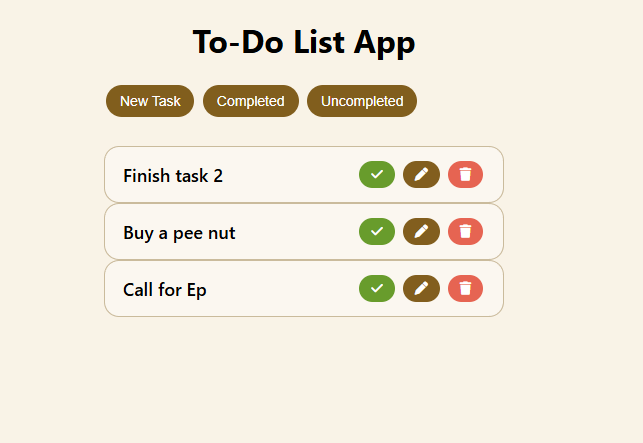
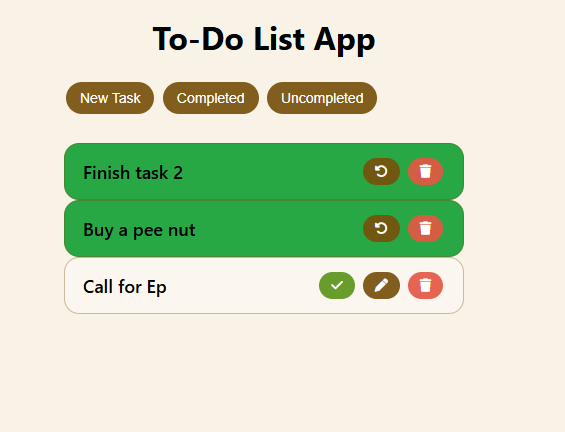
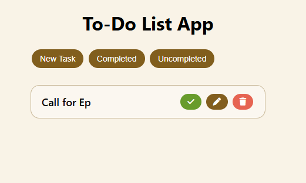
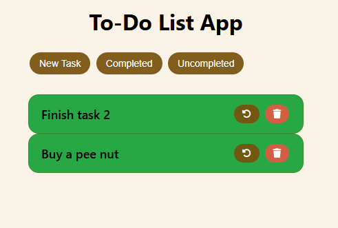

# Task Manager App

## Features

- Add new tasks easily
- Mark tasks as completed
- View completed and uncompleted tasks
- Filter tasks to show only completed or only uncompleted tasks

## How to Use

### Step 1: Add a New Task

When you want to create a new task, start by typing the task details in the input box.  

### Step 2: Task Created

After adding the task, it will appear in the list of tasks.  

### Step 3: Complete a Task

You can mark a task as completed. Completed tasks will be visually distinct.  

### Step 4: Filter Uncompleted Tasks

Use the filter option to view only tasks that are not yet completed.  

### Step 5: Filter Completed Tasks

You can also filter to see only the tasks that are completed.  

